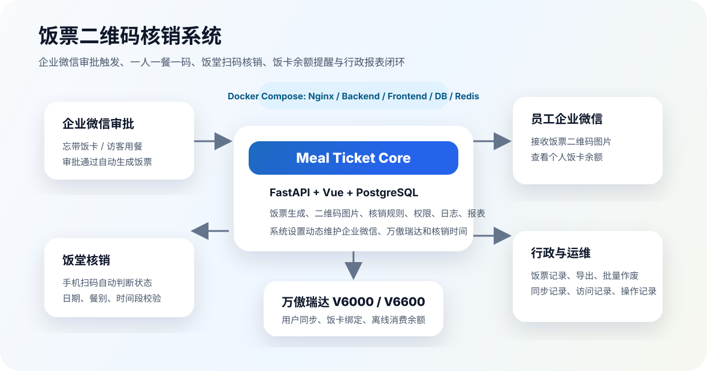
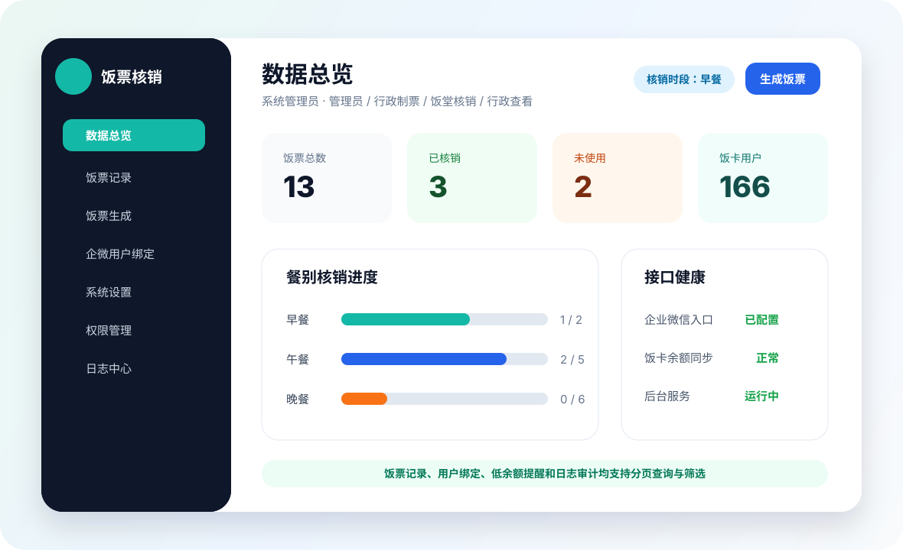
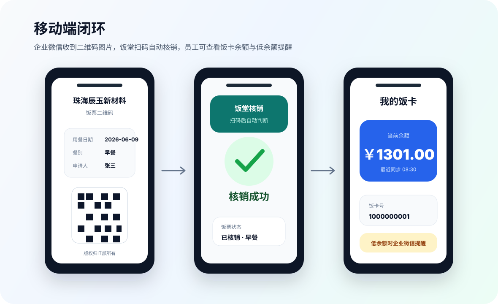
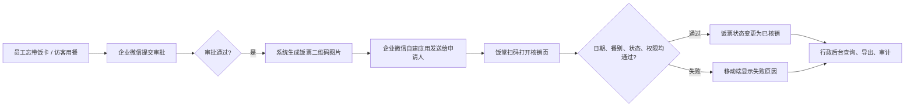

# 饭票二维码核销系统


饭票二维码核销系统用于处理员工忘带饭卡、访客临时用餐、行政饭票核实等场景。系统支持企业微信审批通过后自动生成饭票二维码图片，饭堂人员扫码后按权限、用餐日期和餐别时间段完成核销，行政人员可在后台查询、作废、导出和审计饭票记录。

> 目标是把“审批、发票、核销、报表、饭卡余额提醒”做成一个可 Docker 部署、可后台配置、可二次开发的生产级闭环系统。



## 功能亮点

| 模块 | 能力 |
| --- | --- |
| 企业微信审批 | 审批通过自动生成饭票，支持审批字段映射、部门中文名、二维码图片发送 |
| 一人一餐一码 | 支持“用餐人数 x 多选餐别”批量生成，确保每人每餐独立二维码 |
| 饭堂扫码核销 | 手机相机、微信或企业微信扫一扫打开核销页，自动判断成功或失败原因 |
| 核销规则 | 校验饭票状态、用餐日期、早餐/午餐/晚餐核销时段、过期和作废状态 |
| 后台管理 | 数据总览、饭票分页筛选、批量作废、Excel 导出、权限管理、系统设置 |
| 权限角色 | `admin` 管理员、`hr` 行政制票、`verifier` 饭堂核销、`auditor` 行政查看 |
| 饭卡余额 | 同步企业微信用户与万傲瑞达饭卡用户，支持绑定、余额展示和低余额提醒 |
| 日志审计 | 同步记录、访问记录、操作记录分离，低余额推送成功/失败可追踪 |
| 开源部署 | Docker Compose 一键启动 PostgreSQL、Redis、FastAPI、Vue、Nginx |

## 界面预览

### 桌面后台



### 移动端与二维码



## 典型流程



## 技术栈

- 后端：Python 3.12、FastAPI、SQLAlchemy、Alembic、PostgreSQL、Redis
- 前端：Vue 3、Element Plus、Vite、Lucide Icons
- 集成：企业微信审批回调、审批详情、自建应用消息、临时素材图片、万傲瑞达离线消费余额
- 部署：Docker Compose、Nginx

## 快速开始

```bash
cp .env.example .env
docker compose up -d --build
```

首次启动会创建默认管理员账号：

```text
用户名：admin
密码：使用 .env 中的 INITIAL_ADMIN_PASSWORD；留空时查看后端容器日志中的随机密码
```

上线前请设置新的 `JWT_SECRET_KEY`、数据库密码和后台系统设置；首次登录后请立即修改管理员密码。

## 生产部署

本项目支持远程服务器构建与调试，本机不需要启动完整生产环境：

```bash
SSH_HOST=your-server \
SSH_USER=root \
SSH_PORT=22 \
REMOTE_DIR=/opt/meal-ticket \
./deploy/remote_deploy.sh
```

企业微信参数、审批字段、万傲瑞达接口、核销时间段、低余额提醒等业务配置都在后台“系统设置”维护，不需要反复修改 `.env`。

## 文档导航

| 文档 | 内容 |
| --- | --- |
| [文档首页](docs/README.md) | 文档地图、角色入口和二次开发路径 |
| [架构设计](docs/architecture.md) | 系统模块、数据流、权限边界 |
| [生产部署与企业微信联调](docs/production-setup.md) | 服务器部署、企业微信审批回调、联调清单 |
| [后台操作手册](docs/user-guide.md) | 饭票生成、核销、报表、用户绑定、低余额提醒 |
| [配置项说明](docs/configuration.md) | 后台系统设置、企业微信、万傲瑞达、核销时间 |
| [万傲瑞达对接方案](docs/wanoa-v6000-integration-plan.md) | 用户同步、离线消费余额、字段映射 |
| [万傲 V6600 API 探查](docs/wanoa-v6600-api-discovery.md) | 厂商 API 发现与联调记录 |
| [企业微信饭卡余额入口](docs/wecom-card-balance-entry.md) | 自建应用打开个人余额页 |
| [二次开发指南](docs/development.md) | 本地开发、代码结构、测试和扩展 |
| [运维手册](docs/operations.md) | 常用命令、备份恢复、排障 |
| [GitHub 自动建仓与推送](docs/github-publish.md) | GitHub CLI、公开仓库、自动推送 |

## 开发与验证

本地前端构建需要 Node.js `20.19+` 或 `22.12+`；Docker 构建使用 `node:22-alpine`。

```bash
python3 -m compileall backend/app backend/alembic/versions
cd backend && python3 -m ruff check app alembic --select F,E9
node --check frontend/src/main.js
cd frontend && npm run build
```

## 安全提示

- `.env`、证书、数据库备份、真实企业微信 Secret、GitHub Token 不应提交到仓库。
- GitHub Token 请存入系统钥匙串或 GitHub CLI，不要写入脚本、README 或 `.git/config`。
- 生产环境建议启用 HTTPS，并为后台账号配置强密码。
- 默认管理员只用于初始化，上线后必须修改。
- 建议使用临时 SSH key、受限部署账号或堡垒机账号联调。

## 许可证

本项目使用 MIT License。详见 [LICENSE](LICENSE)。
