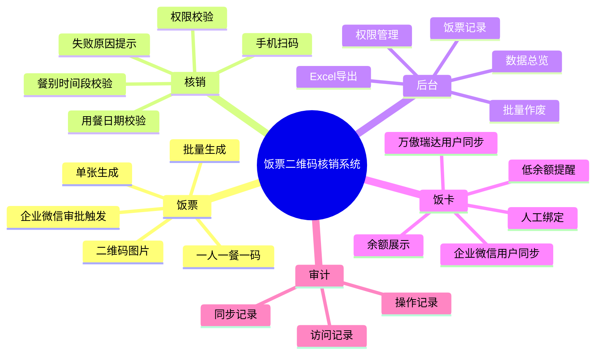

# 项目文档中心

这里是饭票二维码核销系统的文档入口，适合部署人员、行政人员、饭堂核销人员、二次开发者和开源使用者快速找到需要的内容。


## 按角色阅读

| 角色 | 推荐阅读 |
| --- | --- |
| 项目负责人 / 开发经理 | [架构设计](architecture.md)、[界面升级原型](ui-refresh-prototype.md)、[二次开发指南](development.md) |
| 运维 / 实施人员 | [生产部署与企业微信联调](production-setup.md)、[配置项说明](configuration.md)、[运维手册](operations.md) |
| 行政人员 | [后台操作手册](user-guide.md)、[配置项说明](configuration.md) |
| 饭堂核销人员 | [后台操作手册](user-guide.md) 中的扫码核销章节 |
| 企业微信管理员 | [生产部署与企业微信联调](production-setup.md)、[企业微信饭卡余额入口](wecom-card-balance-entry.md) |
| 万傲瑞达对接人员 | [万傲瑞达 V6000 对接方案](wanoa-v6000-integration-plan.md)、[V6600 API 探查记录](wanoa-v6600-api-discovery.md) |
| 开源维护者 | [GitHub 自动建仓与推送](github-publish.md)、[贡献指南](../CONTRIBUTING.md)、[安全策略](../SECURITY.md) |

## 功能地图



## 截图示意

### 桌面后台


### 移动端闭环


## 文档目录

| 文件 | 说明 |
| --- | --- |
| [architecture.md](architecture.md) | 系统架构、模块职责、数据流 |
| [production-setup.md](production-setup.md) | 服务器准备、Docker 部署、企业微信联调 |
| [user-guide.md](user-guide.md) | 后台使用、饭票生成、核销、饭卡用户、日志 |
| [configuration.md](configuration.md) | 后台系统设置项说明 |
| [wecom-card-balance-entry.md](wecom-card-balance-entry.md) | 企业微信自建应用打开饭卡余额页 |
| [wanoa-v6000-integration-plan.md](wanoa-v6000-integration-plan.md) | 万傲瑞达用户与饭卡余额对接方案 |
| [wanoa-v6600-api-discovery.md](wanoa-v6600-api-discovery.md) | 厂商 API 探查和接口记录 |
| [ui-refresh-prototype.md](ui-refresh-prototype.md) | 前端主题升级和原型说明 |
| [development.md](development.md) | 二次开发、目录结构、测试命令 |
| [operations.md](operations.md) | 运维命令、备份恢复、排障 |
| [github-publish.md](github-publish.md) | GitHub CLI、自动建仓、推送规范 |

## 开源前检查

- 不提交 `.env`、证书、数据库备份、真实 Secret、GitHub Token。
- 文档示例使用 `your-domain.com`、`your-server` 等占位符。
- 生产部署记录如果包含内网 IP、账号、域名和排障细节，应放在私有运维知识库。
- 提交前建议执行：

```bash
python3 -m compileall backend/app backend/alembic/versions
cd backend && python3 -m ruff check app alembic --select F,E9
node --check frontend/src/main.js
cd frontend && npm run build
```
