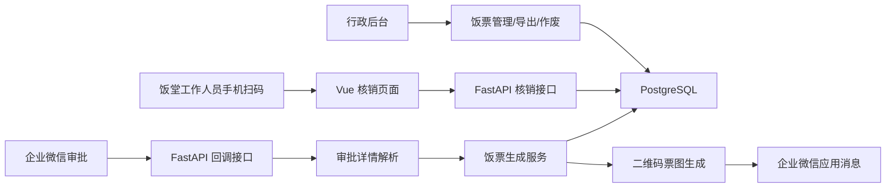

# 架构设计

## 业务目标

系统面向饭票申请、发放、核销和行政核对流程。员工或访客用餐需求通过企业微信审批发起，审批通过后系统生成饭票二维码图片并发送给申请人。饭堂工作人员使用手机扫一扫打开核销链接，系统根据权限、日期、餐别时间段和票据状态判断是否允许核销。

## 总体架构



## 服务组成

- `frontend`：Vue 3 单页应用，提供后台管理、系统设置、权限管理、核销页面。
- `backend`：FastAPI 服务，负责业务 API、企业微信回调、饭票生成、核销、导出。
- `postgres`：核心业务数据库。
- `redis`：预留缓存组件，当前 Compose 已包含，便于后续扩展。
- `nginx`：统一入口，反向代理前端和 `/api`。

## 核心模块

后端目录：

- `app/api`：HTTP API 路由。
- `app/models`：SQLAlchemy 数据模型。
- `app/schemas`：Pydantic 输入输出模型。
- `app/services`：业务逻辑，包括系统设置、饭票、企业微信。
- `app/utils`：token 和企业微信加解密工具。
- `alembic/versions`：数据库迁移。

前端目录：

- `frontend/src/main.js`：Vue 应用、页面模板、接口调用。
- `frontend/src/style.css`：后台和移动端样式。
- `frontend/nginx.conf`：前端容器内 Nginx 静态资源配置。

## 数据模型

主要表：

- `users`：后台用户、角色、企业微信 UserID、部门。
- `meal_tickets`：饭票主表，包含员工、部门、用餐日期、餐别、状态、核销时间。
- `verification_logs`：核销日志，记录成功和失败原因。
- `wecom_approval_events`：企业微信审批事件处理记录。
- `system_settings`：后台可维护系统参数。

## 饭票状态

- `unused`：未使用，可以进入核销校验。
- `used`：已核销，不能重复核销。
- `expired`：已过期，不能核销。
- `void`：已作废，不能核销。

核销时按顺序校验：

1. 二维码 token 是否存在。
2. 饭票状态是否为 `unused`。
3. 用餐日期是否等于当前系统时区日期。
4. 是否超过 `expire_at`。
5. 当前时间是否在餐别核销时间段内。
6. 原子更新状态为 `used`。

## 企业微信流程

企业微信审批回调进入 `/api/wecom/callback/approval`。系统支持加密 XML 回调，也支持开发联调用明文 JSON。审批通过后会拉取审批详情，解析用餐日期、餐别、用餐人数、申请人和部门，然后批量生成饭票。

部门名称解析顺序：

1. 审批字段中已包含中文部门名。
2. 企业微信通讯录部门接口。
3. 后台“部门ID映射”。
4. 最后兜底显示部门 ID。

## 权限模型

- `admin`：系统管理员，可操作所有功能。
- `hr`：行政制票，可生成、作废、查询、导出。
- `verifier`：饭堂核销，只能核销饭票。
- `auditor`：行政查看，只能查询和导出。

`admin` 默认拥有全部角色能力。

## 部署拓扑

生产部署推荐：

```text
用户/企业微信 -> HTTPS 入口/负载均衡 -> Nginx -> frontend/backend -> PostgreSQL/Redis
```

当前 Compose 内置 HTTP 入口，生产建议在外层配置 HTTPS 证书终止。
