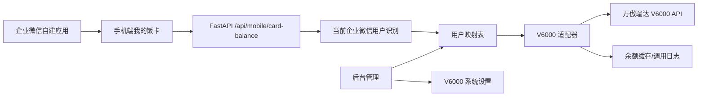

# 万傲瑞达 V6000/V6600 饭卡余额对接方案

## 1. 背景目标

现有系统已完成饭票二维码生成、企业微信审批回调、饭堂扫码核销和行政报表。下一阶段希望接入万傲瑞达 V6000/V6600 平台，将企业微信 UserID 与平台人员/卡号绑定，面向员工提供企业微信自建应用内的手机端饭卡余额查询。

升级目标：

- 员工通过企业微信自建应用进入“我的饭卡”，查看当前饭卡余额和最近更新时间。
- 后台支持维护企业微信 UserID 与 V6000 人员编号、卡号、工号的映射关系。
- 系统设置页面支持配置 V6000 网关地址、认证参数、接口超时、缓存策略。
- 后端通过适配器调用 V6000，避免把厂商接口细节散落在饭票业务代码中。
- 与现有饭票核销系统共用用户、角色、系统设置和企业微信应用入口。

## 2. 外部平台认知

公开资料显示，万傲瑞达 V6000/V6600 是综合安防/一卡通平台，覆盖人事、考勤、门禁、访客、消费、停车等多个业务子系统，并支持第三方集成扩展。饭卡余额通常属于“消费”或“一卡通”子系统能力。

示例平台地址 `https://wanoa.example.com` 的登录页显示为“万傲瑞达6600”，后续真实接口以实际环境内置 Swagger 为准。探查记录见 [wanoa-v6600-api-discovery.md](wanoa-v6600-api-discovery.md)。

由于余额查询接口不属于稳定公开接口，落地前必须向厂商或现场实施方确认：

- V6000/V6600 版本号和部署方式。
- 是否开启开放平台/API 网关。
- 认证方式：账号密码、Token、AppKey/AppSecret、签名、IP 白名单或 VPN。
- 人员查询接口、卡片查询接口、余额查询接口、消费流水接口。
- 字段含义：人员编号、工号、卡号、卡内号、账户号、部门 ID、账户余额、冻结余额。
- 金额单位：元、分或厘。
- 接口限流、分页、超时、错误码和审计要求。

## 3. 总体架构



设计原则：

- 业务 API 只关心“某个企业微信用户的饭卡余额”，不关心 V6000 的具体接口形态。
- V6000 认证、签名、HTTP 调用、字段转换集中在 `services/card_platforms/`。
- 余额查询默认只读，不在本系统内扣费，避免与 V6000 消费主账务产生一致性风险。
- 对员工端展示使用短缓存，降低 V6000 压力；行政后台可提供“强制刷新”。

## 4. 数据模型建议

当前项目第一阶段已落地三张表，命名以 V6000/V6600 通用集成为目标：

- `external_user_candidates`：外部用户候选表，分别保存企业微信和万傲同步结果。
- `card_user_bindings`：企业微信 `userid` 与万傲 `pin` 的人工确认绑定表，并缓存最近余额结果。
- `external_sync_runs`：外部用户同步运行记录，用于后续审计和排障。

这样做的原因是姓名和部门可能重名或不一致，系统先自动同步候选，再由管理员选择双方记录建立映射，避免手工输入错误。

### 4.1 `card_user_bindings`

用于维护企业微信用户与 V6000 用户/饭卡的映射。

| 字段 | 说明 |
| --- | --- |
| `id` | 主键 |
| `user_id` | 本系统 `users.id`，可为空，允许仅按企业微信 UserID 绑定 |
| `wecom_userid` | 企业微信 UserID，唯一或联合唯一 |
| `employee_name` | 员工姓名 |
| `department` | 部门中文名 |
| `v6000_person_id` | V6000 人员 ID |
| `v6000_employee_no` | V6000 工号 |
| `v6000_card_no` | 卡号或账户号 |
| `binding_status` | `active`、`disabled`、`unmatched` |
| `last_synced_at` | 最近同步时间 |
| `remark` | 备注 |
| `created_at` / `updated_at` | 审计时间 |

建议唯一约束：

- `wecom_userid`
- `v6000_person_id`
- `v6000_card_no`

如现场存在“一人多卡”，则将卡片拆为 `card_accounts` 表。

### 4.2 `card_balance_snapshots`

用于缓存最近一次余额结果，避免每次打开手机页面都打到 V6000。

| 字段 | 说明 |
| --- | --- |
| `id` | 主键 |
| `binding_id` | 绑定关系 |
| `balance_amount` | 可用余额，建议用分保存 |
| `frozen_amount` | 冻结金额，建议用分保存 |
| `currency` | 默认 `CNY` |
| `source_updated_at` | V6000 返回的余额更新时间 |
| `fetched_at` | 本系统拉取时间 |
| `raw_payload` | 原始响应脱敏 JSON |

### 4.3 `card_platform_call_logs`

用于排障和审计外部接口调用。

| 字段 | 说明 |
| --- | --- |
| `id` | 主键 |
| `provider` | `wanoa_v6000` |
| `operation` | `get_balance`、`sync_user`、`search_person` |
| `request_id` | 本系统请求 ID |
| `target_key` | 人员 ID/卡号/企业微信 UserID |
| `success` | 是否成功 |
| `status_code` | HTTP 状态或平台错误码 |
| `message` | 错误摘要 |
| `duration_ms` | 调用耗时 |
| `created_at` | 调用时间 |

## 5. 系统设置新增项

后台“系统设置”已新增“万傲瑞达”分组：

- 平台地址：`wanoa_base_url`
- 授权用户名 ID：`wanoa_client_id`
- 接口 access_token：`wanoa_client_secret`
- 人员列表接口路径：`wanoa_person_list_path`
- 饭卡接口路径：`wanoa_card_list_path`
- 同步分页大小：`wanoa_sync_page_size`
- 启用定时同步：`external_user_sync_enabled`
- 同步间隔分钟：`external_user_sync_interval_minutes`
- 启用自动绑定：`external_user_auto_bind_enabled`

敏感字段只在后台可写，不在普通接口回显明文。

说明：当前现场厂商已明确“客户端密钥就是 `access_token`”，系统使用 `wanoa_client_secret` 作为所有万傲接口的 `access_token`。

当前现场使用离线卡消费，饭卡余额取离线消费流水最近一条记录的消费后余额：

```text
GET /api/transaction/listPosTransaction?personPin=<人员编号>&pageNo=1&pageSize=1&access_token=<apitoken>
```

返回的 `data.0.balance` 单位为“元”。

用户同步策略：

- 服务启动后会按 `external_user_sync_interval_minutes` 定时同步企业微信和万傲用户。
- 管理员也可在“系统设置”页面手动同步企业微信和万傲全部用户。
- 自动绑定仅处理企业微信和万傲中同名候选都唯一的记录；重名、缺失或已存在绑定时跳过，避免误绑。

## 6. 后端模块设计

当前实现文件：

```text
backend/app/api/external_users.py
backend/app/models/external_user.py
backend/app/schemas/external_user.py
backend/app/services/external_user_sync.py
backend/app/services/wanoa.py
backend/alembic/versions/0003_external_user_bindings.py
```

已提供 API：

```text
GET  /api/integrations/users/candidates
POST /api/integrations/users/sync/all
GET  /api/integrations/users/bindings
POST /api/integrations/users/bindings
PUT  /api/integrations/users/bindings/{binding_id}
POST /api/integrations/users/balance
```

建议新增目录：

```text
backend/app/api/card_balance.py
backend/app/models/card_binding.py
backend/app/schemas/card_balance.py
backend/app/services/card_platforms/base.py
backend/app/services/card_platforms/wanoa_v6000.py
backend/app/services/card_balance.py
```

### 6.1 适配器接口

```python
class CardPlatformClient(Protocol):
    async def get_balance(self, binding: CardUserBinding) -> CardBalanceResult:
        ...

    async def search_person(self, keyword: str) -> list[CardPersonCandidate]:
        ...
```

V6000 的认证、签名、接口路径、错误码统一封装到 `wanoa_v6000.py`。

### 6.2 业务服务

`card_balance.py` 负责：

- 根据企业微信 UserID 查绑定关系。
- 判断缓存是否有效。
- 调用 V6000 适配器刷新余额。
- 写入余额快照和调用日志。
- 返回员工端安全字段。

### 6.3 API 设计

员工移动端：

```text
GET /api/mobile/card-balance/me
POST /api/mobile/card-balance/refresh
```

后台管理：

```text
GET /api/card-bindings
POST /api/card-bindings
PUT /api/card-bindings/{id}
POST /api/card-bindings/import
POST /api/card-bindings/{id}/refresh-balance
GET /api/card-platform/search-person?keyword=...
```

## 7. 企业微信入口与身份识别

推荐用企业微信网页授权获取当前访问人的 `userid`，而不是让员工输入账号密码。

流程：

1. 企业微信自建应用配置菜单：“我的饭卡”。
2. 菜单地址指向系统移动端入口：`https://your-domain.com/mobile/card`.
3. 前端检测没有移动端 token 时跳转到后端企业微信 OAuth 地址。
4. 后端通过企业微信 OAuth 获取 `userid`。
5. 后端签发短期移动端 JWT，JWT 内包含 `wecom_userid` 和最小权限。
6. 手机端调用 `/api/mobile/card-balance/me` 查询余额。

这样可以复用现有企业微信 CorpID、AgentID、Secret 设置。

## 8. 权限设计

新增角色建议：

- `card_admin`：维护 V6000 参数、绑定关系、导入导出。
- `card_auditor`：查看绑定关系、余额快照和同步日志。
- `employee_mobile`：企业微信移动端访问自己的余额，不进入桌面后台。

也可以先不新增后台角色，短期由 `admin` 维护，员工端使用移动端专用 token。

## 9. UI 功能清单

桌面端新增：

- `饭卡管理`
  - 用户映射列表
  - 绑定状态筛选
  - 按姓名、企业微信 UserID、工号、卡号搜索
  - 手工绑定/编辑/禁用
  - 批量导入 Excel
  - 单人刷新余额
- `系统设置`
  - 新增 V6000 配置分组
  - 增加“测试连接”按钮

移动端新增：

- `我的饭卡`
  - 员工姓名、部门
  - 可用余额大号展示
  - 卡号脱敏展示
  - 最近更新时间
  - 刷新按钮
  - 异常提示：未绑定、平台不可用、余额查询失败

## 10. 缓存与稳定性

建议默认缓存 60 到 300 秒。

缓存策略：

- 员工首次打开：如果无缓存或缓存过期，实时查询 V6000。
- V6000 调用失败：如果有 10 分钟内旧缓存，可以展示旧缓存并提示“余额可能不是最新”。
- 后台强制刷新：忽略缓存，直接调用 V6000。

超时建议：

- 连接超时 3 秒。
- 读取超时 8 秒。
- 单次请求不建议无限重试，避免员工端等待过长。

## 11. 安全与合规

- V6000 密钥不写入 `.env.example` 和文档，只在后台设置或生产 `.env` 保存。
- 员工端只能查询自己的余额，不能通过参数查询他人。
- 余额接口返回卡号时默认脱敏。
- 调用日志不保存完整密钥、签名、身份证号、手机号等敏感信息。
- 如涉及消费流水，需明确数据保留周期和查询权限。

## 12. 分阶段实施

### 第一阶段：接口文档确认与平台适配骨架

- 获取 V6000 API 文档或现场测试账号。
- 新增系统设置项和适配器骨架。
- 新增绑定表、余额快照表、调用日志表。
- 用 Mock V6000 客户端打通员工端余额查询。

### 第二阶段：企业微信移动端

- 新增企业微信网页授权登录。
- 新增移动端“我的饭卡”页面。
- 支持未绑定、查询失败、缓存余额展示。

### 第三阶段：后台饭卡管理

- 新增绑定列表、手工绑定、导入导出。
- 支持按企业微信 UserID 自动匹配系统用户。
- 增加单人刷新余额和连接测试。

### 第四阶段：真实 V6000 联调

- 接入真实认证、签名和余额接口。
- 联调错误码映射。
- 压测并调整缓存时间。
- 补充运维文档和故障排查。

## 13. 需要用户协助提供的信息

对接前需要确认：

- V6000 访问地址，是否只能内网访问。
- API 文档或二开接口包。
- 测试账号、AppKey/AppSecret 或厂商提供的认证参数。
- 员工唯一标识选择：工号、手机号、身份证号、卡号还是 V6000 人员 ID。
- 企业微信 UserID 与 V6000 员工标识是否已有现成表。
- 是否只查余额，还是后续还要查消费流水、挂失、补卡、充值记录。
